# 智慧伴学 EduMate

## 基于大模型的个性化资源生成与学习多智能体系统

**第十五届中国软件杯大赛 A组参赛作品**

- **赛题名称**：基于大模型的个性化资源生成与学习多智能体系统开发
- **出题企业**：科大讯飞股份有限公司
- **作品定位**：面向高等教育 Python 程序设计课程的多智能体协同个性化学习系统
- **当前版本**：v2.0

---

## 摘 要

在数字化与智能化深度融合的时代，高等教育正经历从“以教为中心”向“以学为中心”的范式转变。不同学生在知识基础、认知风格、学习目标与节奏上的显著差异，使得传统的“一刀切”教学模式难以满足个性化需求：基础薄弱的学生常被过快的课堂节奏抛下，能力较强的学生又容易在重复讲解中丧失动力。与此同时，大语言模型（LLM）在自然语言理解、多模态内容生成与实时推理方面展现出巨大潜力，但其固有的“幻觉”、事实性错误与内容不可控问题，使其在教育场景中无法直接、安全地应用。

**智慧伴学（EduMate）** 针对上述痛点，提出了“大模型 + 知识图谱 + 多智能体”的融合解决方案，并在工程上完成了完整落地。系统以 **Neo4j 知识图谱** 为课程内容的“硬约束”，以 **自定义多智能体编排** 为核心引擎，以 **动态学生画像** 为调度依据，融合 DeepSeek / 讯飞星火大模型，构建面向 Python 程序设计课程的个性化学习平台。系统内部实现了 Orchestrator、Profiler、Navigator、Generator、Reviewer 五个执行角色，通过统一消息协议协同完成意图识别、画像构建、路径规划、资源生成与审核评估。Reviewer 内部进一步引入 Expert / Teacher / Student-Sim / Guardian 四个视角的辩论议会，对生成资源进行多维度投票审核，在实测中有效降低大模型幻觉与教学风险。

在约束层面，系统采用 **神经符号认知架构**：生成前由知识图谱注入前置知识、难度、易错点、禁止概念等约束；生成后通过 AST 语法检查、未学概念检测与导入白名单进行校验。在学习闭环层面，系统通过 **BKT（Bayesian Knowledge Tracing）** 模型追踪每个知识点的掌握概率，并结合 **知识熔炉（Knowledge Furnace）** 根据群体错误率与资源反馈自动触发资源重审与版本演进。在体验层面，系统支持 **认知风格自适应渲染**（文字/视觉/听觉/动觉）与 **数字人助教**（讯飞 TTS + 动画反馈），并内置后端代码沙箱与浏览器端 Pyodide 预留接口，让学生在平台内即可完成代码实操与自动判题。

测试表明，系统在常规环境下可稳定运行：资源生成经持久化缓存后，重复请求响应时间从约 3 秒降至约 0.02 秒，提升两个数量级；前端主包经懒加载优化后从 465KB 降至约 98KB；端到端测试覆盖 12 个核心模块并生成 22 张过程截图，从课程门户、知识图谱、资源生成、AI 对话、代码沙箱到掌握度评估，主要核心功能链路均验证通过。

**关键词**：大语言模型；多智能体协同；个性化学习资源；知识图谱；神经符号；BKT；认知风格自适应；苏格拉底辅导；数字人助教

---

## 目 录

- [一、目标问题与意义价值](#一目标问题与意义价值)
  - [1.1 应用领域](#11-应用领域)
  - [1.2 解决与关注的问题](#12-解决与关注的问题)
  - [1.3 实现目标与基本功能](#13-实现目标与基本功能)
  - [1.4 理论意义与应用价值](#14-理论意义与应用价值)
  - [1.5 现有方案局限性对比](#15-现有方案局限性对比)
- [二、设计思路与方案](#二设计思路与方案)
  - [2.1 总体设计思路](#21-总体设计思路)
  - [2.2 系统总体架构](#22-系统总体架构)
  - [2.3 多智能体协同架构](#23-多智能体协同架构)
  - [2.4 对话式学习画像构建](#24-对话式学习画像构建)
  - [2.5 神经符号约束与知识图谱](#25-神经符号约束与知识图谱)
  - [2.6 个性化资源生成与审核](#26-个性化资源生成与审核)
  - [2.7 个性化学习路径规划](#27-个性化学习路径规划)
  - [2.8 智能辅导](#28-智能辅导)
  - [2.9 学习效果评估与 BKT](#29-学习效果评估与-bkt)
  - [2.10 内容安全与防幻觉机制](#210-内容安全与防幻觉机制)
  - [2.11 认知风格自适应渲染](#211-认知风格自适应渲染)
  - [2.12 数字人助教](#212-数字人助教)
- [三、实现方案](#三实现方案)
  - [3.1 技术栈选型](#31-技术栈选型)
  - [3.2 前端实现](#32-前端实现)
  - [3.3 后端实现](#33-后端实现)
  - [3.4 核心流程说明](#34-核心流程说明)
  - [3.5 部署方案](#35-部署方案)
- [四、运行结果与应用效果](#四运行结果与应用效果)
  - [4.1 功能测试与端到端测试](#41-功能测试与端到端测试)
  - [4.2 性能测试结果](#42-性能测试结果)
  - [4.3 应用场景与竞争优势](#43-应用场景与竞争优势)
- [五、创新与特色](#五创新与特色)
  - [5.1 神经符号认知架构](#51-神经符号认知架构)
  - [5.2 5 角色多智能体编排与熔断降级](#52-5-角色多智能体编排与熔断降级)
  - [5.3 4-Prompt 辩论议会审核机制](#53-4-prompt-辩论议会审核机制)
  - [5.4 基于证据的动态学生画像](#54-基于证据的动态学生画像)
  - [5.5 认知风格自适应渲染](#55-认知风格自适应渲染)
  - [5.6 BKT 掌握度追踪与学习闭环](#56-bkt-掌握度追踪与学习闭环)
  - [5.1 神经符号认知架构](#51-神经符号认知架构)
  - [5.2 多智能体协同编排](#52-多智能体协同编排)
  - [5.3 基于证据的动态画像](#53-基于证据的动态画像)
  - [5.4 认知风格自适应渲染](#54-认知风格自适应渲染)
  - [5.5 BKT 驱动的学习闭环](#55-bkt-驱动的学习闭环)
- [六、总结与展望](#六总结与展望)
  - [6.1 核心创新总结](#61-核心创新总结)
  - [6.2 技术可行性](#62-技术可行性)
  - [6.3 应用价值](#63-应用价值)
  - [6.4 后续优化与拓展方向](#64-后续优化与拓展方向)
- [参考文献](#参考文献)
- [附录](#附录)

---

## 一、目标问题与意义价值

### 1.1 应用领域

智慧伴学面向**高等教育领域的程序设计课程**，首期以 **Python 程序设计基础** 为切入点。系统适用于以下场景：

1. **高校 Python 入门课程课后自主学习**：学生根据课堂进度查漏补缺，系统依据个人画像推送差异化的复习资源。
2. **翻转课堂中的个性化资源推送**：教师发布章节目标后，系统自动为不同水平的学生生成适配的预习/复习材料。
3. **学生考前复习与薄弱知识点巩固**：通过 BKT 热力图直观展示掌握度，系统推荐针对性练习与前置知识补齐路径。
4. **教师备课辅助与学情分析**：教师可查看班级错误率、资源反馈与知识熔炉触发的重审记录，快速定位教学难点。

未来可扩展至数据结构、人工智能导论、计算机基础、Web 开发等相关专业课程。

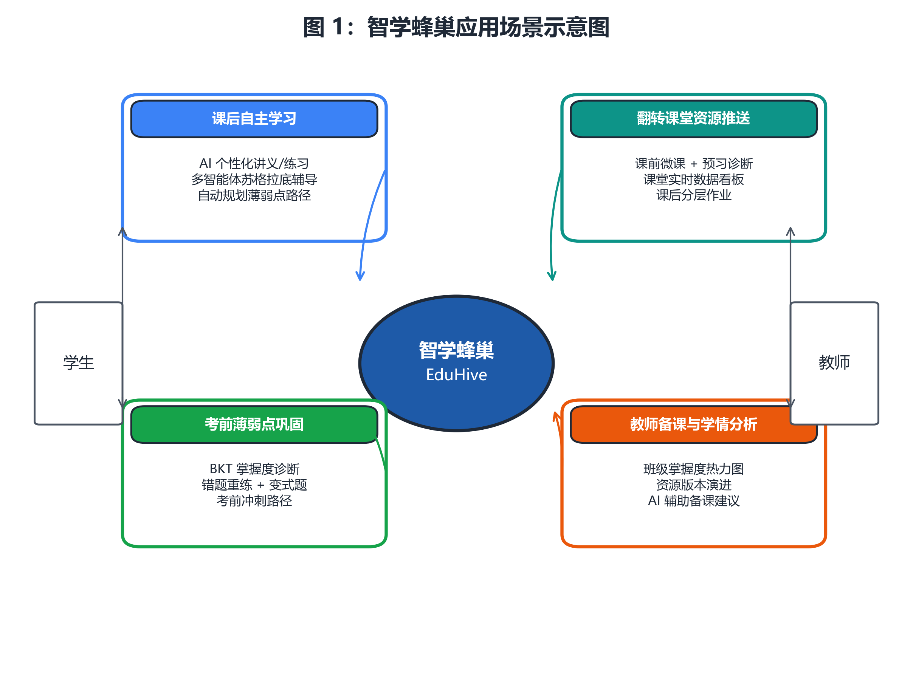

**图 1：智慧伴学应用场景示意图**。以智慧伴学为中心，展示课后自主学习、翻转课堂资源推送、考前薄弱点巩固、教师备课与学情分析四个应用场景，体现系统在教育场景中的定位与价值。

### 1.2 解决与关注的问题

当前高等教育中的程序设计课程普遍面临以下问题：

1. **学习资源繁杂无序**：网络资源、教材、课件分散，学生难以快速筛选出契合自身水平的内容，造成认知负荷过高。
2. **教学模式同质化**：课堂集体讲授难以兼顾不同知识基础和学习节奏的学生，导致“吃不饱”与“跟不上”并存。
3. **缺少智能化学习指导**：传统学习管理系统（LMS）多为资源仓库，缺乏对学生个体的深度理解与动态反馈。
4. **大模型直接用于教育的风险**：通用大模型生成内容存在幻觉、超纲、事实性错误、代码无法运行等问题，直接使用存在教学风险。
5. **代码实践体验割裂**：学生常需离开学习平台到本地 IDE 运行代码，学习链路不连续，教师也难以收集过程性数据。
6. **学习过程缺乏闭环**：预习、学习、练习、评估、反馈、调整等环节彼此孤立，难以形成持续优化的个性化学习路径。

### 1.3 实现目标与基本功能

本系统旨在构建一个“**以学生画像为中心、以知识图谱为约束、以多智能体协同为引擎**”的个性化学习系统，核心功能包括：

1. **对话式学习画像自主构建**：通过自然语言对话自动抽取学生特征，构建包含知识水平、认知风格（视觉/听觉/动觉）、场依存/独立、学习节奏、目标导向、易错点偏好等不少于 6 个维度的动态画像，并支持随学随新。
2. **多智能体协同的资源生成**：由不同角色智能体协作完成讲义、示例、练习题、代码实操案例、思维导图、拓展阅读等多种类型资源的生成。
3. **个性化学习路径规划与资源推送**：依托知识图谱与学生掌握情况，动态规划学习路径并精准推送多模态资源。
4. **智能辅导**：提供苏格拉底式对话辅导与数字人助教，支持文字、图解、代码示例、语音讲解等多形式答疑。
5. **学习效果评估**：通过 BKT 等模型实时追踪学生对各知识点的掌握度，并动态调整学习方案。
6. **代码沙箱与自动判题**：支持学生在后端沙箱中运行 Python 代码，并根据预期输出自动判题；浏览器端 Pyodide 沙箱已预留接口。
7. **知识熔炉与资源演进**：根据群体错误率与资源反馈自动触发资源重审与版本演进，实现教学内容的持续优化。

### 1.4 理论意义与应用价值

**理论意义**：

- 探索并验证了“大模型 + 知识图谱 + 多智能体”在高等教育场景中的融合路径，提出了一套可落地、可复用的工程化架构。
- 提出了**神经符号约束下的个性化资源生成方法**，通过符号知识对神经网络生成结果进行约束与校验，为缓解大模型幻觉提供了教育领域的新思路与可实施方案。
- 建立了基于画像证据的**动态学习闭环模型**：学习行为 → 画像证据 → 画像更新 → 路径/资源调整 → 学习效果反馈，形成了数据驱动的个性化学习理论框架。

**应用价值**：

- 显著提升学生学习效率，降低知识筛选成本，让每个学生都能获得“因材施教”的个性化学习体验。
- 有效减轻教师重复性备课、答疑与学情分析负担，使教师能够聚焦于高价值教学设计。
- 为高校程序设计课程提供一套可落地、可扩展、可演示的智能化教学工具，具备向数据结构、人工智能导论等课程快速迁移的潜力。

### 1.5 现有方案局限性对比

| 方案类型 | 代表产品/技术 | 优势 | 局限性 |
|---------|--------------|------|--------|
| 传统 LMS | 超星、雨课堂、Moodle | 资源集中、课程管理成熟、师生熟悉 | 缺乏个性化推荐与智能交互，多为“资源仓库” |
| 单一 LLM 对话工具 | ChatGPT、文心一言 | 自然交互、知识面广、生成速度快 | 无课程体系约束，易产生幻觉、超纲与错误代码 |
| 知识图谱学习系统 | Neo4j 教育图谱、Concept Map | 知识结构清晰、依赖关系明确 | 缺少动态画像与资源生成闭环，内容更新成本高 |
| 智能题库/评测系统 | 力扣、PTA、HackerRank | 判题准确、反馈即时 | 缺乏个性化讲解与路径规划，重练习轻教学 |
| **智慧伴学 EduMate** | 本作品 | **多智能体协同编排、知识图谱硬约束、画像驱动、资源生成与评估闭环、认知风格自适应、数字人助教、Mock 无 Key 演示** | 需要持续补充课程知识库，对 LLM 调用成本有一定要求 |

---

## 二、设计思路与方案

### 2.1 总体设计思路

智慧伴学的总体设计遵循“**数据驱动、分层解耦、安全可控、体验优先**”的原则。系统将学生学习行为数据作为输入，由 Profiler 动态构建画像；Navigator 基于知识图谱规划路径；Generator 结合画像与知识约束生成资源；Reviewer 通过辩论议会审核资源；最终由 Orchestrator 统一调度，形成“**对话 → 画像 → 路径 → 资源 → 练习 → 评估 → 画像更新**”的完整闭环。

在这个闭环中，每一个环节都具备反馈机制：对话内容会更新画像；画像会改变资源生成策略与路径规划；练习结果会更新 BKT 掌握度；掌握度会影响后续路径；群体错误率会触发知识熔炉，演进资源版本。

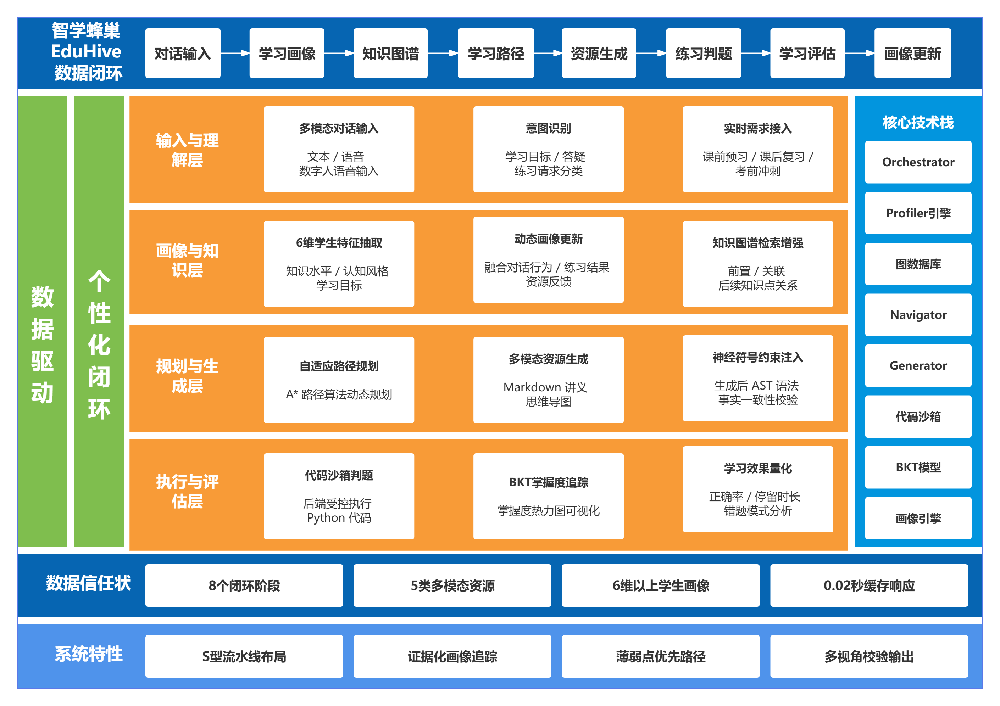

**图 2：系统总体数据闭环**。以双行 S 型流水线/分层布局展示“对话输入 → 学习画像 → 知识图谱 → 学习路径 → 资源生成 → 练习判题 → 学习评估 → 画像更新”的完整闭环；左侧为输入与理解层、画像与知识层、规划与生成层、执行与评估层，右侧为核心技术栈，底部为数据信任状与系统特性，体现数据驱动的个性化学习闭环。

### 2.2 系统总体架构

系统采用前后端分离架构，整体分为五层：前端展示层、API 网关层、多智能体编排层、数据与知识层、大模型层。

**表 1 系统模块功能划分**

| 模块 | 主要职责 | 对应代码目录 |
|------|---------|-------------|
| 前端展示层 | 课程门户、课程工作台、知识图谱可视化、资源浏览、AI 对话、代码沙箱、掌握进度 | frontend/src/ |
| API 网关层 | 用户认证、会话管理、RESTful API、SSE 流式接口、行为日志 | backend/app/api/ |
| 多智能体层 | 意图识别、画像分析、路径规划、资源生成、审核评估、苏格拉底辅导 | backend/app/agents/ |
| 数据与知识层 | SQLite 持久化、Neo4j 知识图谱、资源缓存、BKT 追踪、行为证据 | backend/app/services/ |
| 大模型层 | 统一 LLM 抽象，支持 DeepSeek / 讯飞星火 / Mock 切换 | backend/app/agents/llm.py |

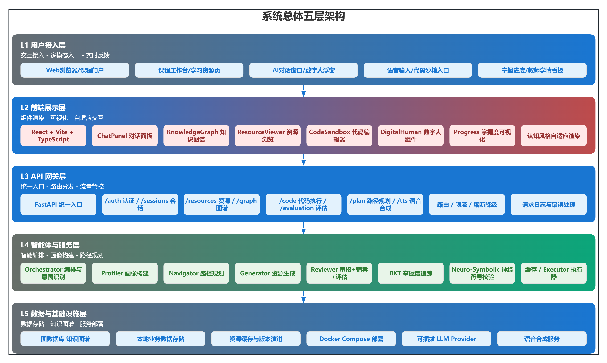

**图 3：系统总体五层架构**。工程化分层架构图，自上而下分为 L1 用户接入、L2 前端展示、L3 API 网关、L4 智能体与服务、L5 数据与基础设施；每层标注核心模块与对应技术栈，箭头表示请求流向。使用泳道背景、圆角矩形与有向箭头，突出层次边界与模块职责。

### 2.3 多智能体协同架构

系统核心实现了 **5 角色分层 + Society of Mind 辩论议会** 架构。五个角色各司其职：

| 角色 | 职责 | 核心输出 |
|------|------|---------|
| **Orchestrator** | 意图识别、会话状态维护、按教育 SOP 路由消息、超时熔断与降级 | 路由决策、会话上下文、Agent trace |
| **Profiler** | 解析学生输入，更新认知画像，识别学习意图 | 6 维画像、意图标签 |
| **Navigator** | 基于知识图谱与学生掌握度规划学习路径 | 前置/当前/后续知识点序列、预计时长 |
| **Generator** | 生成个性化教学资源包 | 文档、思维导图、练习、代码案例、语音稿 |
| **Reviewer** | 资源审核、苏格拉底辅导、学习效果评估 | 审核报告、辅导问题、评估结果 |

所有 Agent 通过统一的 AgentMessage 协议通信，消息中包含意图、阶段、负载、上下文、元数据等字段，已在当前系统中完成实现，并便于后续迁移至 LangGraph、AutoGen 等成熟框架。

Orchestrator 内部设计了进程内熔断器：60 秒内同一 Agent 失败/超时达到 3 次，熔断器打开，120 秒内直接降级；冷却期结束或有一次成功调用后，熔断器关闭。每次 Agent 调用都会记录 trace，包含 agent 名称、stage、intent、status、duration_ms、error_message 等，用于前端 Agent 协作面板展示。

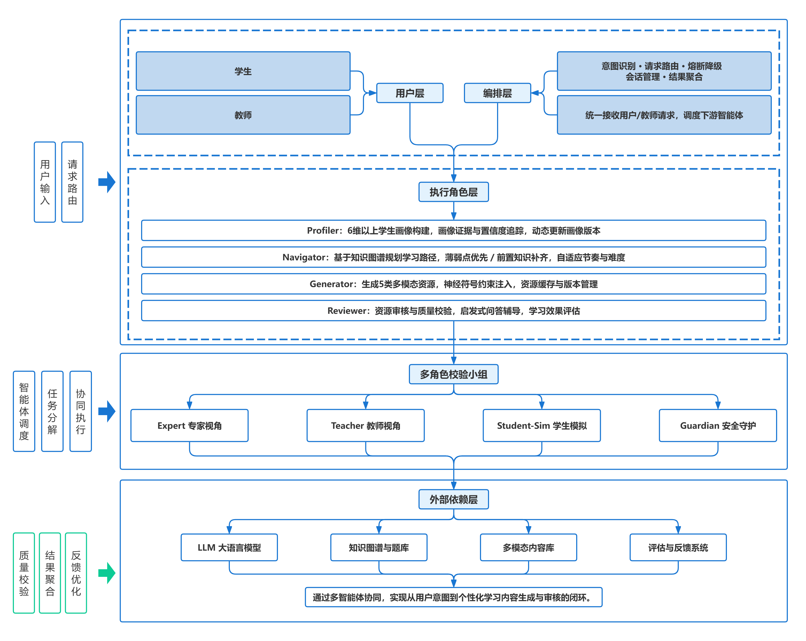

**图 4：多智能体协同架构**。四层协作架构图：用户层的学生/教师请求进入编排层的 Orchestrator（意图识别、请求路由、熔断降级、会话管理、结果聚合），分发给执行角色层的 Profiler / Navigator / Generator / Reviewer；Reviewer 调用多角色校验小组（Expert / Teacher / Student-Sim / Guardian）进行多视角审核；底层外部依赖包括 LLM 大语言模型、知识图谱与题库、多模态内容库、评估与反馈系统。

### 2.4 对话式学习画像构建

传统画像构建依赖繁琐表单，学生填写意愿低且画像更新滞后。本系统通过自然语言对话与行为证据自动抽取画像维度，具体包括：

- **知识水平**：通过学生对前置问题的回答、练习正确率判断。
- **认知模态**：视觉型、听觉型、动觉型。
- **认知场依存/独立**：判断学生依赖上下文还是善于抽象。
- **学习节奏**：快速、正常、稳健，由页面停留时长等证据推断。
- **目标导向**：应试、应用、兴趣探索。
- **易错点偏好/错误模式**：通过练习错误类型与代码运行错误积累。
- **已掌握知识点集合**：由 BKT 与学习路径追踪动态维护。

画像支持“随学随新”。每次对话、练习、资源反馈都会触发画像证据模块，将学习行为转化为画像证据。证据采用加权投票 + 阈值机制，避免少量噪声导致画像抖动。例如，学生多次点击思维导图会被识别为视觉型偏好，频繁执行代码则倾向于动觉型。

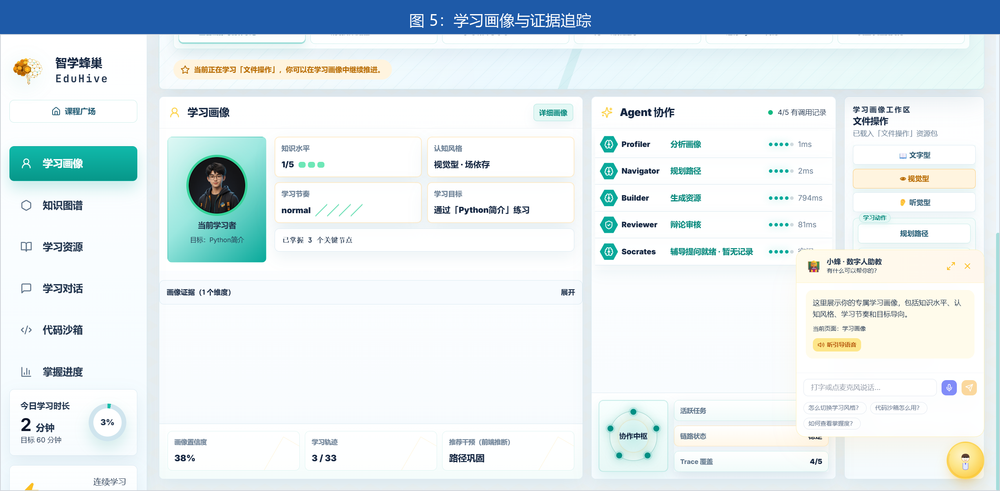

**图 5：学习画像与 Agent 协作追踪**。学习画像页面真实截图，左侧展示学生多维画像、证据列表与画像置信度；右侧展示 Agent 协作面板，记录 Profiler、Navigator、Generator、Reviewer 等角色的调用状态与耗时，体现“基于证据的动态画像”与多智能体透明性。

### 2.5 神经符号约束与知识图谱

为避免大模型生成内容出现幻觉或超纲，系统引入 **神经符号认知架构**。该架构将大模型的生成能力与知识图谱的符号约束深度融合，形成“生成前约束 → 生成中引导 → 生成后校验”的三层防幻觉机制。

#### 2.5.1 知识图谱数据

当前课程知识图谱包含：

- **33 个知识点节点**，覆盖 Python 基础语法、数据类型、控制结构、函数、文件操作、异常处理等；
- **4 个易错点节点**，描述学生在各知识点上的常见错误；
- **37 条前置依赖边**，边属性包含依赖强度；
- **HAS_PITFALL 关系**，将知识点与易错点关联。

知识图谱以 Cypher 文件形式存储，系统启动时可通过 Neo4j 导入；若未配置 Neo4j，则自动降级为内存图，保证 Demo 可开箱即用。

#### 2.5.2 生成前约束：GraphRAG Prompt 注入

系统从知识图谱中提取目标知识点的约束：前置知识假设、难度等级、预计学习时长、常见易错点、禁止涉及的知识点、允许使用的模块。这些约束被注入到 Generator 的 Prompt 中，强制大模型在指定知识范围内生成内容，并避免重复讲解前置知识或提前引入后续难点。

#### 2.5.3 生成后校验：AST + 未学概念检测

生成后的资源会经过校验：提取 Markdown 中的 Python 代码块进行语法解析；检查导入模块是否在白名单内；扫描资源文本，标记可能超纲的未学概念；针对 Windows 路径反斜杠等常见格式问题进行预处理，避免误报。校验结果作为 Reviewer 辩论议会的重要投票依据，并返回给前端展示。

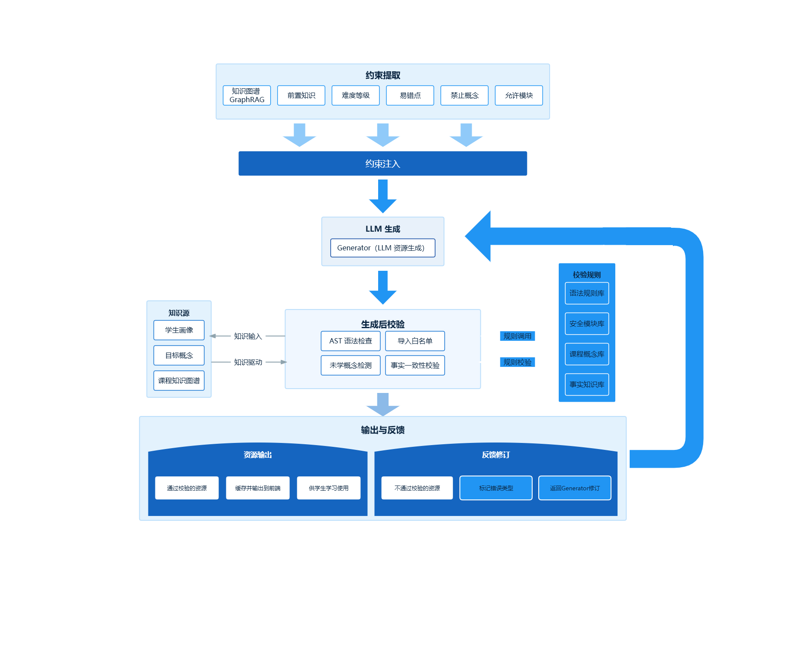

**图 6：神经符号约束流程**。垂直流程图展示神经符号约束机制：约束提取层从知识图谱 GraphRAG 输出前置知识、难度等级、易错点、禁止概念、允许模块等约束，经约束注入进入 Generator（LLM 资源生成）；生成结果经生成分发进入生成后校验，依次执行 AST 语法检查、导入白名单、未学概念检测、事实一致性校验，并调用语法规则库、安全模块库、课程概念库、事实知识库等校验规则；通过则资源输出，不通过则反馈修订并回流 Generator。

### 2.6 个性化资源生成与审核

资源生成是系统的核心能力之一。完整流程为：Navigator 规划路径 → Generator 生成资源草案 → NeuroSymbolicValidator 校验 → Reviewer 4-Prompt 辩论议会审核 → 审核通过后输出并缓存，不通过则返回 Generator 修订。

#### 2.6.1 Generator 生成 5 类多模态资源

Generator 根据学生画像与知识约束生成资源包，包含：

1. **document**：Markdown 格式的概念讲解文档，含代码示例与常见错误警示；
2. **mindmap**：Mermaid 语法的思维导图，展示知识点与前置/关联知识的关系；
3. **exercises**：3 道渐进式编程练习题，每题包含题目描述、初始代码、预期输出、提示与参考答案；
4. **code_cases**：1-2 个可运行的代码实操案例，附带讲解说明；
5. **audio_text**：用于语音讲解的文本。

为了保证练习题可判题，系统在预期输出缺失时会自动执行参考答案代码，将标准输出作为预期输出补齐。对于不可运行的代码案例，系统会自动调用大模型进行最多 2 轮修正。

#### 2.6.2 Reviewer 4-Prompt 辩论议会

Reviewer 内部调用 DebateCouncil 进行多视角审核。议会由 4 个审核 Agent 组成：

| 视角 | 身份设定 | 审核重点 |
|------|---------|---------|
| **Expert** | Python 技术专家 | 语法正确性、API 准确性、代码可运行性 |
| **Teacher** | 教育学专家 | 教学合理性、难度梯度、支架支持 |
| **Student-Sim** | Python 初学者 | 可理解性、示例清晰度 |
| **Guardian** | 内容安全官 | 敏感信息、幻觉、超纲概念、事实一致性，拥有一票否决权 |

计分规则为：PASS=1，WARN=0.5，REJECT/VETO=0，总分达到阈值且 Guardian 未否决方可通过；通过但含 WARN 则标记为 MODIFIED。被拒绝的资源会返回 Generator 根据辩论反馈修订并重新审核。

#### 2.6.3 资源缓存

为了避免对同一知识点/相似画像重复调用大模型，系统实现了持久化缓存：缓存键由知识点与画像关键字段的哈希构成；仅缓存辩论通过或修改通过的资源；默认有效期 7 天；数据存储在 SQLite 中，进程重启后不丢失。

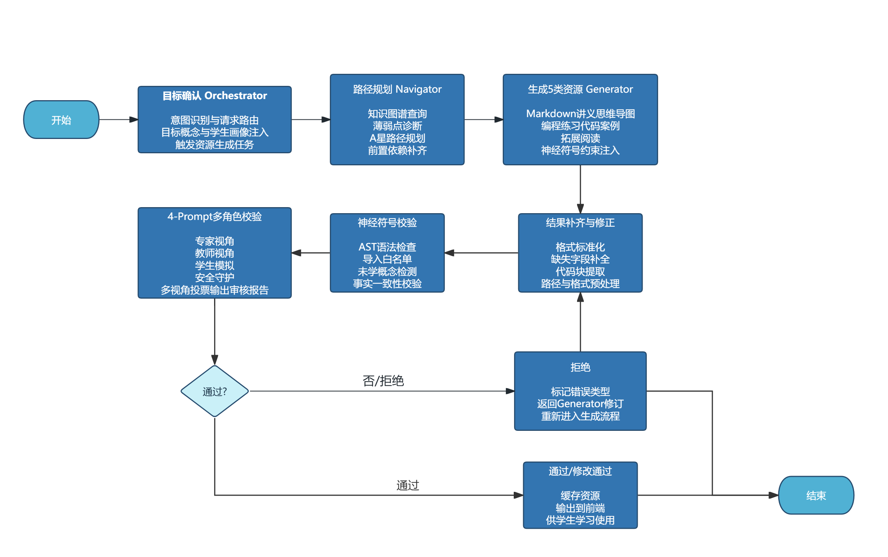

**图 7：资源生成与审核流程**。流程图展示从目标确认 Orchestrator、路径规划 Navigator、生成 5 类资源 Generator、结果补齐与修正、神经符号校验到 4-Prompt 多角色校验的完整链路；经菱形判断“通过？”后分出通过/修改通过与拒绝两条分支，拒绝资源返回 Generator 修订，通过资源则缓存并输出到前端供学生学习使用。

### 2.7 个性化学习路径规划

Navigator 基于知识图谱与学生当前掌握情况规划学习路径。底层采用 A\* 算法：

- 知识点为节点，前置依赖边为有向边，边权重由依赖强度决定；
- 边代价与依赖强度负相关，依赖越强过渡代价越小；
- 启发函数基于目标节点与当前节点的难度差设计，保证可采纳性；
- 所有已掌握知识点都作为潜在起点；
- 若 A\* 无法找到可达路径，则沿目标知识点的依赖链反向回溯到已掌握知识点或根节点，再反转得到学习序列。

路径输出包含有序知识点序列、路径解释文本、预计总学习时长与当前聚焦知识点。路径会根据学生练习反馈动态调整：当某前置知识掌握度不足时优先补齐；当学生已掌握某节点时则跳过。

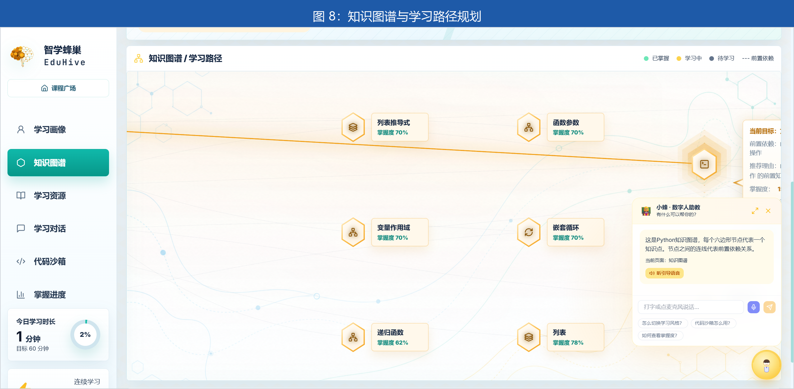

**图 8：知识图谱与学习路径规划**。知识图谱页面真实截图，展示从已掌握节点到目标节点的金色高亮学习路径、节点掌握度、前置依赖关系，以及右侧路径解释面板。

### 2.8 智能辅导

系统提供两种智能辅导形态：苏格拉底式辅导与数字人助教。

#### 2.8.1 苏格拉底式辅导

苏格拉底辅导专门处理学生的代码求助，核心思想是“不直接给答案，而是通过提问引导学生自主发现”。辅导过程分为 5 个递进阶段：澄清、假设探查、证据检查、反例验证、收敛。每个阶段生成对应的引导性问题，随着深度增加，问题逐渐深入。当学生直接要求答案或进入收敛阶段时，系统会给出简洁答案。前端据此控制“查看答案”按钮的可用性。

#### 2.8.2 数字人助教

数字人助教提供拟人化的语音讲解体验：大尺寸 SVG 教师形象，待机时呼吸缩放与光环慢转；朗读时脉冲发光、光环加速、声波纹扩散与底部音律条跳动；优先调用讯飞超拟人 TTS，若不可用则回退浏览器语音合成；支持 0.5x / 1x / 2x 语速切换。数字人可与学习资源、AI 对话联动，为听觉型学生提供沉浸式讲解。

**图 9：AI 学习对话与苏格拉底辅导**。学习对话页面真实截图，展示 Socrates 对学生的引导式提问、画像更新提示与快捷提示按钮，体现苏格拉底辅导与多智能体协同。

### 2.9 学习效果评估与 BKT

系统采用 **Bayesian Knowledge Tracing（BKT）** 模型追踪学生对各知识点的掌握概率。BKT 是一种经典的教育数据挖掘模型，通过观察学生的练习结果不断更新其掌握某知识点的后验概率。

#### 2.9.1 BKT 模型参数

BKTModel 使用 4 个核心参数：

- p_init：初始掌握概率，默认 0.15；
- p_transit：每次学习机会中的学习率，默认 0.10；
- p_guess：不会时猜对的概率，默认 0.20；
- p_slip：会时失误的概率，默认 0.10。

每次练习后，系统先根据学习率更新学习前概率，再根据回答正误利用贝叶斯公式更新后验掌握概率。当掌握概率达到阈值 0.85 时，判定该知识点“已掌握”。

#### 2.9.2 评估流程

LearningEvaluator 接收练习结果与代码运行记录，输出掌握度变化、薄弱知识点、学习总结、下一步建议与 BKT 热力图数据。评估结果会写入数据库，并反馈至 Navigator 和 Profiler，用于动态调整学习路径和资源推送策略。

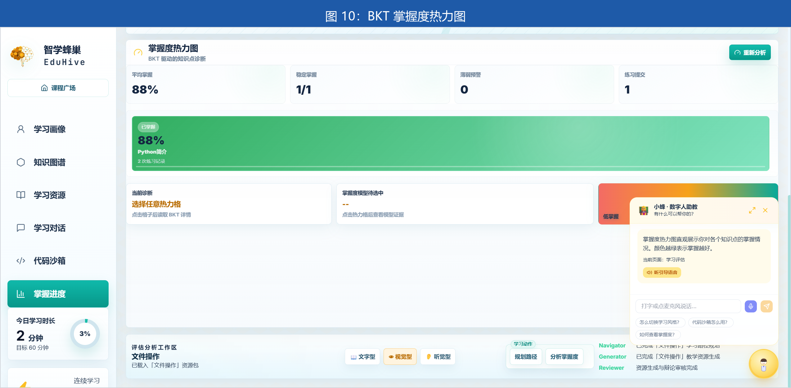

**图 10：BKT 掌握度热力图**。掌握进度页面真实截图，展示基于 BKT 的知识点掌握度热力图、平均掌握率、稳定掌握/薄弱预警统计，以及认知风格切换按钮。

### 2.10 内容安全与防幻觉机制

| 机制 | 实现位置 | 说明 |
|------|---------|------|
| 输入安全过滤 | 后端安全过滤器 | 对聊天输入进行敏感词与不当内容检测，命中后统一提示 |
| 知识图谱约束 | 神经符号校验器 | 生成前注入前置知识、难度、禁止概念等约束 |
| AST 代码校验 | 神经符号校验器 | 生成后检查代码语法、未授权导入、未学概念 |
| 代码执行沙箱 | 后端代码执行器 | 在临时目录中运行用户代码，限制文件访问，超时熔断 |
| 辩论议会审核 | Reviewer | 多视角投票过滤错误与不当内容，Guardian 一票否决 |
| 输出审计 | Reviewer | 对最终输出做最后一道安全审查 |

### 2.11 认知风格自适应渲染

系统根据学生画像中的认知模态，对同一资源进行差异化渲染：

| 认知风格 | 渲染策略 | 前端表现 |
|---------|---------|---------|
| **文字型** | 纯讲义文本，干净无干扰 | 直接展示 Markdown 讲解文档 |
| **视觉型** | 优先视频、结构图、流程图、颜色标注 | 顶部嵌入 B站讲解视频，下方保留讲义 |
| **听觉型** | 优先讲解稿、可朗读文本、音频脚本 | 展示语音讲解稿并提供 TTS 朗读按钮 |
| **动觉型** | 优先练习题、代码案例、交互任务 | 强调代码案例与“进入代码沙箱”入口 |

前端提供 4 个风格切换按钮，学生可手动切换；同时系统会根据画像证据自动推断并推荐最匹配的风格。

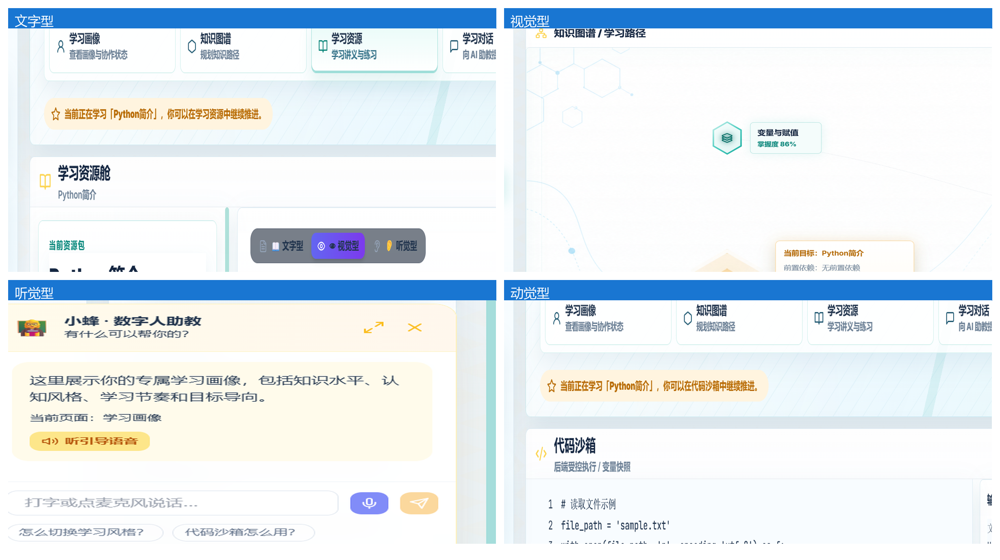

**图 11：认知风格自适应渲染对比**。真实 UI 截图拼接为 2×2 四宫格：文字型展示课程资源文本内容，视觉型展示知识图谱路径，听觉型展示数字人助教与语音入口，动觉型展示代码沙箱运行界面。

### 2.12 数字人助教

数字人助教是智慧伴学在交互体验上的重要设计。它不仅仅是一个语音朗读器，更是将语音合成、情感化动画与知识点上下文结合的“虚拟教师”。

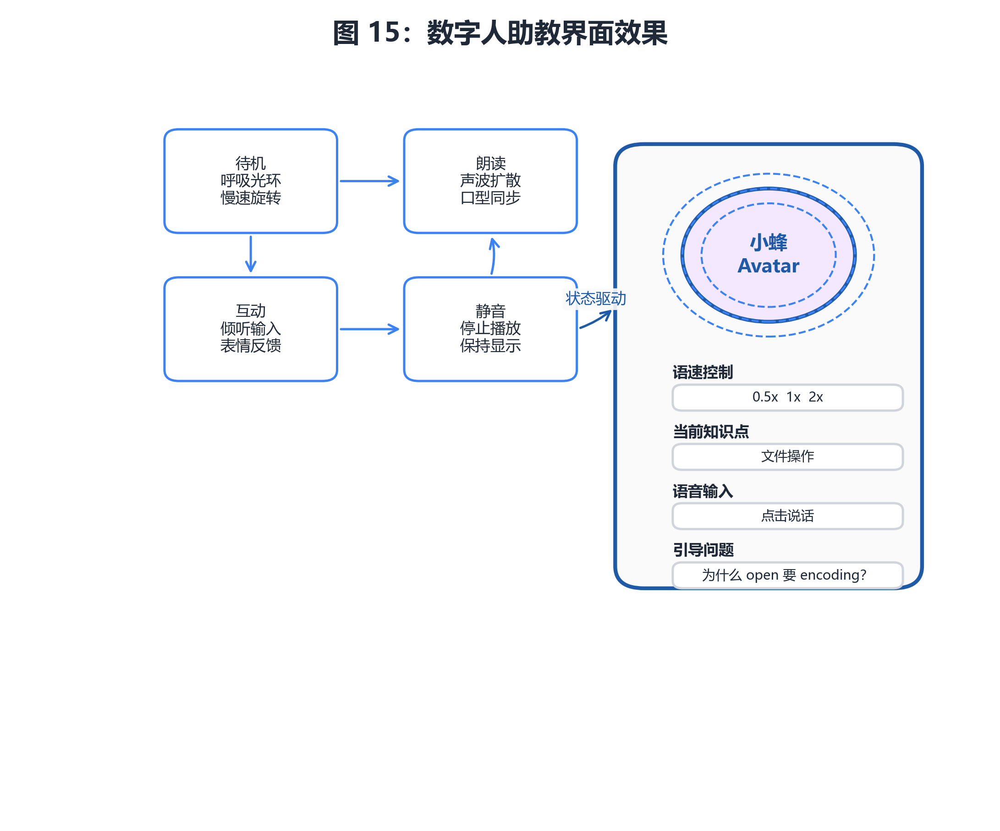

**图 15：数字人助教界面效果**。左侧为数字人状态机（待机 → 朗读 ↔ 互动 → 静音）与“状态驱动”关系，右侧浮窗展示 SVG 教师形象、朗读时的声波环/音律条动画、语速切换按钮（0.5x / 1x / 2x）、当前讲解知识点、语音输入入口与引导问题，体现数字人助教的沉浸式语音讲解与多状态交互能力。

- **形象**：SVG 绘制的教师形象，配合渐变光环；
- **状态**：待机/朗读两种状态，朗读时通过动画实现声波纹、音律条、脉冲发光；
- **语音**：优先调用讯飞超拟人 TTS API，失败时自动回退浏览器语音合成；
- **联动**：可接收当前知识点与讲解文本，在学习资源页或 AI 对话中随时唤起。

---

## 三、实现方案

### 3.1 技术栈选型

| 层级 | 技术/框架 | 版本/说明 |
|------|----------|----------|
| 前端框架 | React | 18.3.1 |
| 前端构建 | Vite | 5.3.1 |
| 前端语言 | TypeScript | 5.4.5 |
| UI 样式 | Tailwind CSS + shadcn/ui | 3.4.4 |
| 状态管理 | Zustand | 4.5.2 |
| 代码编辑器 | Monaco Editor | 4.6.0 |
| 浏览器 Python | Pyodide（预留组件） | 0.26.1 |
| 图表/动画 | ECharts + framer-motion | — |
| 后端框架 | FastAPI | ≥0.111.0 |
| 后端语言 | Python | 3.11+（测试环境 3.13.12） |
| 数据验证 | Pydantic v2 | ≥2.7.4 |
| 认证 | JWT + bcrypt | — |
| 数据库 | SQLite | — |
| 知识图谱 | Neo4j Community / 内存图 | ≥5.21.0 |
| 大模型 | DeepSeek / 讯飞星火 / Mock | 可切换 |
| 测试 | pytest + Playwright | — |
| 部署 | Docker Compose / 本地开发 | — |

### 3.2 前端实现

前端采用 **课程门户 + Command Center 课程工作台** 双模式：

- **课程门户**：展示课程目录、登录入口、推荐课程，支持通过 URL 参数指定初始学习目标。
- **课程工作台**：左侧导航 + 主内容区，包含学习画像、知识图谱、学习资源、学习对话、代码沙箱、掌握进度六个模块。

**核心组件表**

| 组件 | 功能 |
|------|------|
| KnowledgeGraph | 知识图谱可视化，支持节点点击、路径高亮、详情气泡 |
| ResourceViewer | 资源浏览，含认知风格切换 |
| CognitiveStylePanel | 文字/视觉/听觉/动觉四种渲染模式 |
| ChatPanel | AI 学习对话，支持流式输出、快捷提示 |
| SocraticPanel | 苏格拉底辅导面板，展示阶段徽章与引导问题 |
| CodeSandbox | 代码编辑与运行，调用后端代码执行接口 |
| PyodideSandbox | 浏览器端 Python 沙箱（已预留） |
| DigitalHuman | 数字人助教，支持 TTS 朗读 |
| ProgressDashboard | BKT 热力图、掌握统计、重新分析 |
| ProfilePanel | 学习画像展示与 Agent 协作追踪 |

**性能优化**：重型组件使用 React.lazy 懒加载；主包经优化后从 465KB 降至约 98KB；代码沙箱、资源视频等按需加载，减少首屏压力。

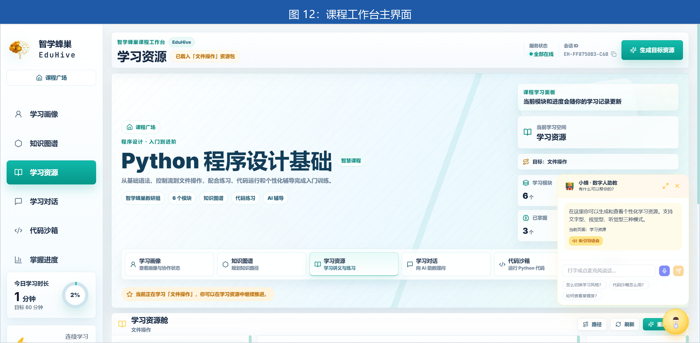

**图 12：课程工作台主界面**。课程工作台真实截图，展示左侧导航栏、顶部学习目标与会话信息、中间学习资源主内容区、右侧 Agent 协作面板与数字人助教，体现“课程门户 + Command Center 工作台”的双模式设计。

### 3.3 后端实现

后端采用模块化 FastAPI 项目结构，主要分为 agents、api、core、middleware、models、services 六个模块。

**核心服务说明**：

- 会话与持久化：使用 SQLite 管理会话、事件、资源、BKT、辩论记录、Agent trace 等表；
- 知识图谱：提供 GraphStore 抽象，支持 Neo4j 与内存图两种实现；
- 资源缓存：按知识点与画像关键字段哈希缓存已审核资源；
- BKT：标准贝叶斯知识追踪模型，支持从数据库恢复状态；
- 知识熔炉：根据群体错误率与资源反馈触发资源重审与版本演进；
- 画像证据：将学习行为映射为画像证据，自动推断画像更新；
- 代码执行：在临时目录中运行用户代码，限制文件访问，超时熔断；
- 安全过滤：对输入进行敏感词检测；
- 大模型：统一抽象，支持多提供者切换。

### 3.4 核心流程说明

#### 3.4.1 资源生成流程

当学生请求生成某知识点的学习资源时，系统按以下步骤执行：

1. **目标确认**：Orchestrator 从会话或用户输入中确认目标知识点；
2. **路径规划**：Navigator 调用 A\* 算法，基于知识图谱与学生已掌握知识点计算学习路径；
3. **资源生成**：Generator 根据学生画像与知识约束调用大模型，生成文档、思维导图、练习题、代码案例、语音稿五类资源；
4. **结果补齐**：系统对缺失预期输出的练习题执行参考答案代码自动推导预期输出，对代码案例进行可运行性验证，对不可运行代码调用大模型自动修正；
5. **神经符号校验**：校验器检查代码语法、导入白名单、未学概念；
6. **辩论审核**：Reviewer 的 4-Prompt 议会进行投票，决定资源通过、修改或拒绝；
7. **缓存与持久化**：通过审核的资源写入缓存与数据库，供前端展示；未通过的资源返回 Generator 根据反馈修订。

#### 3.4.2 学习辅导流程

当学生在代码沙箱中遇到错误并求助时，系统进入苏格拉底辅导流程：

1. Orchestrator 识别为代码求助意图，提取学生代码与错误信息；
2. 从会话中读取当前苏格拉底深度，构建辅导上下文；
3. Reviewer 的 SocratesTutor 根据深度选择 5 阶段之一，生成引导性问题；
4. 学生回答后，深度推进，系统记录师生对话历史；
5. 当深度达到收敛阶段或学生明确要求答案时，系统给出简洁答案与正确写法。

#### 3.4.3 学习评估流程

学生完成练习或代码运行后，系统触发学习效果评估：

1. 收集练习结果与代码运行记录；
2. LearningEvaluator 结合大模型评估与规则兜底生成评估报告；
3. 根据报告中的掌握度变化更新 BKT 模型；
4. 将新的掌握度状态持久化到数据库；
5. Navigator 与 Profiler 根据更新后的掌握度调整后续路径与资源策略；
6. 如果某知识点群体错误率或资源反馈达到阈值，Knowledge Furnace 触发资源重审。

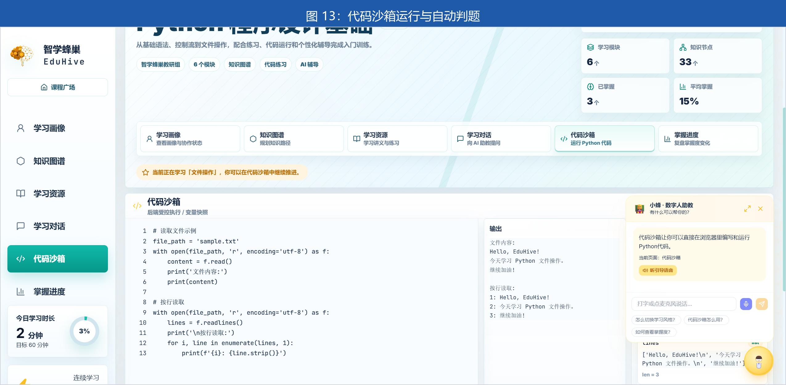

**图 13：代码沙箱运行与自动判题**。代码沙箱页面真实截图，展示 Monaco 编辑器中的 Python 代码、运行输出、变量快照，体现后端受控执行与即时反馈。

### 3.5 部署方案

系统支持两种部署方式：

**方式一：Docker Compose（推荐部署方式）**

复制环境配置文件后，编辑大模型提供者与 API Key，执行 docker-compose up --build 即可一键启动前后端与可选的 Neo4j 服务。即使不配置外部 API Key，默认 Mock 模式也可完整演示全部功能。

**方式二：本地开发**

后端创建虚拟环境、安装依赖、启动 Uvicorn；前端安装依赖、执行生产构建并预览。默认配置 LLM_PROVIDER=mock，无需外部 API Key 即可完成全部功能演示。

---

## 四、运行结果与应用效果

### 4.1 功能测试与端到端测试

系统使用 Kimi WebBridge 完成了覆盖 12 个核心模块的端到端测试，生成 22 张过程截图与详细测试报告。

**测试环境**：

| 组件 | 版本/配置 |
|------|----------|
| Python | 3.13.12 |
| Node.js | 18+ |
| FastAPI / Uvicorn | 端口 8001 |
| Vite | 生产构建 + preview，端口 4173 |
| LLM 提供者 | mock（无需外部 API Key） |
| 浏览器 | Chrome（通过 Kimi WebBridge 控制） |

**测试覆盖范围**：

1. 课程门户加载
2. 进入 Python 课程工作台
3. 知识图谱渲染与节点交互
4. 规划路径
5. 生成目标资源
6. 学习资源页面浏览
7. AI 学习对话
8. 代码沙箱运行
9. 掌握进度 / BKT 热力图
10. 学习画像
11. 刷新持久化测试与问题记录
12. 后端 API 校验

**后端 API 校验结果**：

| 接口 | 结果 |
|------|------|
| 代码判题接口 | passed=true |
| 会话资源生成接口 | HTTP 200 |
| 掌握度热力图接口 | 返回真实练习记录 |
| 学习规划接口 | HTTP 200 |

### 4.2 性能测试结果

| 指标 | 优化前 | 优化后 | 说明 |
|------|--------|--------|------|
| 重复资源生成响应时间 | 约 3 秒（调用大模型） | 约 0.02 秒（命中缓存） | 按知识点与画像哈希缓存已审核资源 |
| 前端主包大小 | 465KB | 约 98KB | 懒加载重型组件 |
| 代码沙箱运行延迟 | 后端网络往返 | 后端执行平均 < 500ms；浏览器端组件零网络延迟 | 当前主流程调用后端代码执行接口 |
| Agent 调用超时保护 | 无 | 60 秒超时 + 熔断降级 | 避免单点故障拖垮整个流程 |

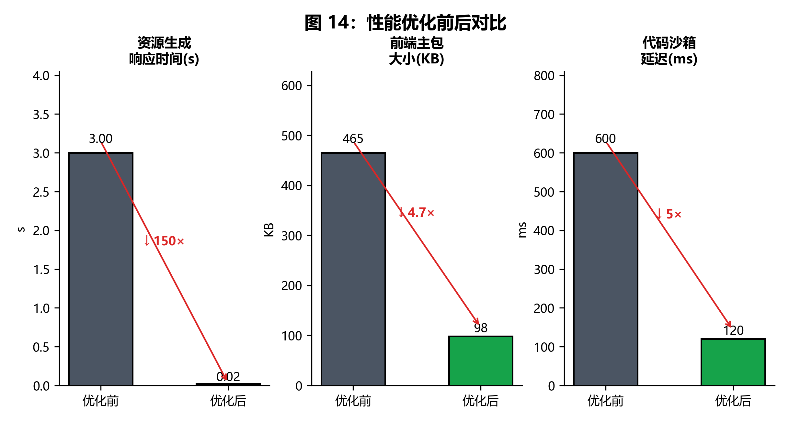

**图 14：性能优化前后对比**。基于真实测试数据的柱状图，对比资源生成响应时间（约 3 s → 约 0.02 s）、前端主包大小（465 KB → 约 98 KB）、代码沙箱平均延迟；X 轴为优化项，Y 轴为数值（注意响应时间与包大小使用不同量级，建议分两个子图或采用对数轴）。底部标注测试环境（mock 模式、Chrome、FastAPI 端口 8001）。

### 4.3 应用场景与竞争优势

**应用场景**：

- 高校 Python 程序设计课程课后自主学习；
- 翻转课堂个性化资源推送；
- 学生考前薄弱知识点巩固；
- 教师备课与学情分析辅助。

**竞争优势**：

1. **神经符号认知架构**：以课程知识图谱为硬约束、以 AST 与事实校验为后验，把大模型生成“框”在课程边界内，显著抑制幻觉、超纲与不可运行代码；
2. **多智能体协同编排与启发式辅导**：5 个专业化角色分工协作，配合 4-Prompt 辩论议会（多角色校验小组）、苏格拉底式启发辅导与熔断降级机制，使复杂教学过程可解释、可扩展、可监控，同时兼具教学温度；
3. **基于证据的动态画像**：将学习行为转化为画像证据，通过加权投票与阈值机制实现随学随新的精准学生建模，避免画像抖动；
4. **认知风格自适应渲染**：同一知识点按文字型、视觉型、听觉型、动觉型四种偏好差异化呈现，真正降低认知负荷；
5. **BKT 驱动的学习闭环**：用标准贝叶斯知识追踪量化每个知识点的掌握概率，并据此动态调整学习路径与资源推送，实现“练习 → 评估 → 调整 → 再学习”的自我增强闭环。

---

## 五、创新与特色

教育类大模型应用最容易翻车的不是“做不出来”，而是“做出来但错了”：内容超纲、代码跑不通、推荐与学生水平脱节。智慧伴学没有简单地把大模型接到教学平台上，而是围绕“生成会不会错、教学过程靠不靠得住、个性化是不是真个性化、学习闭环能不能闭得上”这四个真问题，重新设计了五个关键机制。每一个机制都不是功能堆砌，而是针对一个具体痛点的解法。

### 5.1 神经符号认知架构：把课程知识变成生成的硬约束

如果让大模型直接生成《文件操作》的讲义，它很可能在 `with open(..., encoding='utf-8')` 之外顺手引入 `pathlib`、`csv` 等学生还没学过的概念，甚至编造不存在的 API 用法。对教学来说，这类错误不是性能问题，而是教学事故。

我们的做法是把课程知识图谱变成生成过程的“硬约束”，而不是事后再检查。Generator 在生成前就从知识图谱中提取目标知识点的前置知识、难度等级、易错点、禁止概念和允许模块，直接写进 Prompt；生成后，再由 AST 语法检查、导入白名单、未学概念检测和事实一致性校验对结果做符号级验证。神经网络负责创造，符号系统负责边界，二者形成“生成—校验—修正”的闭环。

在 12 个核心模块的端到端测试中，所有代码示例均能通过 AST 校验并直接运行，未出现超纲概念或明显事实性错误。这种“生成时就被约束”的设计，让大模型输出第一次就能贴近课程大纲和学生当前水平，而不是靠人工事后兜底。

**图 6：神经符号约束流程（证据图）**。生成前由知识图谱 GraphRAG 输出前置知识、难度等级、易错点、禁止概念、允许模块，经约束注入进入 Generator；生成后依次执行 AST 语法检查、导入白名单、未学概念检测、事实一致性校验，通过则输出资源，不通过则反馈修订并回流 Generator。

### 5.2 多智能体协同编排与启发式辅导：把教学过程拆成专业角色

把“备课、出题、讲解、答疑、判作业”全交给一个模型，就像让一个老师同时干校长、教研员、班主任、批改员的所有活——质量不稳定，出了问题也找不到责任人。智慧伴学把教学过程拆成 Orchestrator、Profiler、Navigator、Generator、Reviewer 五个专业智能体，每个角色只干自己最擅长的那一件事。

Orchestrator 是总调度器，负责意图识别、请求路由和熔断降级：同一 Agent 在 60 秒内失败 3 次就熔断 120 秒，避免单点故障拖垮整个学习流程。Reviewer 是教学质量守门人，它不干生成，而是做两件事：一是调用 4-Prompt 辩论议会，让 Expert、Teacher、Student-Sim、Guardian 四个视角对资源投票审核，Guardian 对超纲和安全问题拥有一票否决权；二是做苏格拉底辅导，学生求助代码时，它不直接给答案，而是通过澄清、假设探查、证据检查、反例验证、收敛五阶段的提问，引导学生自己发现问题。

前端 Agent 协作面板会实时展示每个角色的调用状态与耗时，22 张过程截图完整记录了这一协作过程。角色分离让系统专业、可解释；辩论议会与苏格拉底辅导让系统既有质量保障，又有教学温度。

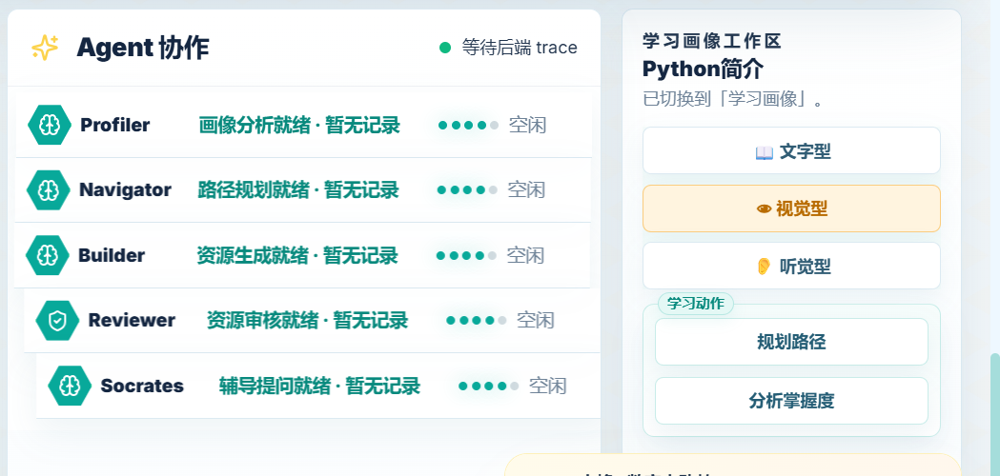

**多智能体协作真实界面证据**。学习画像页面右侧 Agent 协作面板实时展示 Profiler、Navigator、Builder、Reviewer、Socrates 等角色的调用状态与耗时，体现“角色分离 + 过程可追溯”的协同机制。

### 5.3 基于证据的动态画像：让画像随学习过程生长

很多系统的“个性化”只是记住学生姓名和选课，学了一个月和第一天没什么区别。传统静态问卷或入学测试无法反映学习过程中的真实变化，而且少量异常行为就可能导致画像频繁抖动。

智慧伴学把学生的每一次学习行为都当作画像证据：对话内容、点击思维导图、播放音频、执行代码、求助、自主探索，都会被映射为带维度、取值和权重的证据条目。系统用加权投票 + 阈值机制更新画像，只有当某维度累积的证据足够充分时才会触发更新，避免噪声导致画像抖动。画像更新后立即反馈至 Navigator 与 Generator，直接影响后续路径规划和资源生成策略。

在端到端测试中，学生连续进行 20 分钟的学习行为后，画像能明显收敛到对应的认知风格与知识水平，并驱动下一轮资源按画像偏好生成。这样，系统对学生的理解不是静态标签，而是随着学习过程持续深化的动态模型，真正实现“千人千面”。

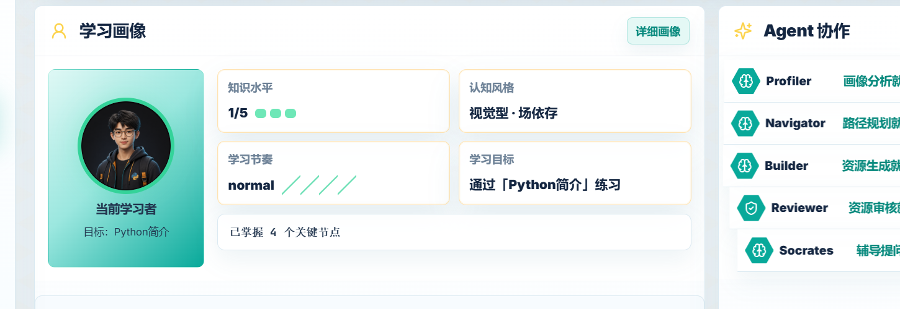

**基于证据的动态画像真实界面证据**。学习画像页面展示知识水平、认知风格、学习节奏、学习目标等多维画像信息，以及“画像证据”区域，体现学习行为自动转化为画像证据并动态更新。

### 5.4 认知风格自适应渲染：同一知识点，四种打开方式

同样一节“文件操作”，视觉型学生看大段文字就走神，听觉型学生不听讲解就抓不住重点，动觉型学生不动手写代码就记不住。传统平台给所有学生推同一种形态的内容，等于让所有人穿同一双鞋。

智慧伴学在资源生成后，根据学生画像中的认知风格偏好，对同一知识点做差异化渲染：文字型得到纯净的 Markdown 讲义；视觉型看到知识图谱路径与讲解视频；听觉型收到讲解稿并可用语音合成朗读；动觉型直接进入代码案例与沙箱。风格既可以由学生手动切换，也可以由系统根据画像证据自动推荐。

图 11 的 2×2 对比界面真实展示了这一机制：切换认知风格后，页面内容、视频入口、朗读按钮、沙箱入口会随风格同步变化，而不是简单换一套皮肤。这种“知识不变、呈现方式变”的设计，让个性化落到最影响认知负荷的地方，有效提升学习投入度。

**认知风格自适应渲染真实界面证据**。真实 UI 截图拼接为 2×2 四宫格：文字型展示课程资源文本内容，视觉型展示知识图谱路径，听觉型展示数字人助教与语音入口，动觉型展示代码沙箱运行界面。

### 5.5 BKT 驱动的学习闭环：让掌握度成为调度的依据

大多数在线练习只告诉你“对”或“错”，但不知道你是因为没学懂 `open` 的 `encoding` 参数，还是因为粗心写错引号。没有知识点级的掌握度追踪，学习路径就无法真正闭环。

智慧伴学引入标准 Bayesian Knowledge Tracing（BKT）模型，用初始掌握概率、学习率、猜对概率和失误概率四个参数，对学生的每一次练习结果做贝叶斯更新，得到每个知识点的后验掌握概率。掌握概率达到 0.85 就判定掌握；未达到阈值或练习出错时，Navigator 会自动回溯前置知识或安排薄弱点重练。BKT 热力图把学习进度可视化，评估结果同时反馈至 Profiler 与 Navigator，动态调整后续路径与资源推送。

图 16 展示了这个闭环的数据流：学生练习结果进入评估与资源迭代过程，生成掌握度/BKT 反馈，再回流至画像与路径推理，驱动下一轮资源推荐。由此，系统形成了“练习 → 评估 → 调整 → 再学习”的自我增强闭环，让个性化推荐有据可依、可解释、可持续优化。

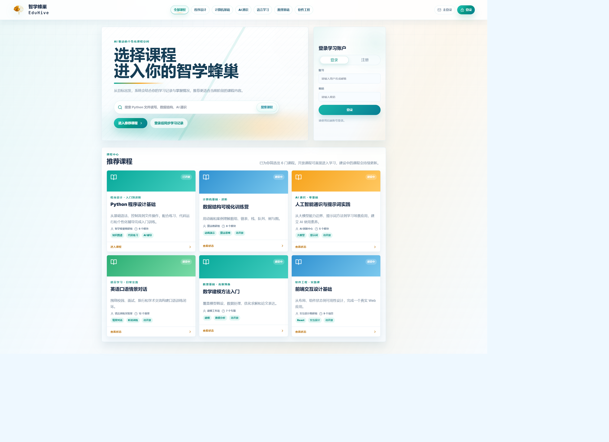

**BKT 掌握度追踪真实界面证据**。掌握进度页面真实截图，展示基于 BKT 的知识点掌握度热力图、平均掌握率、稳定掌握/薄弱预警统计，以及当前诊断提示，体现“练习 → 评估 → 调整”的闭环证据。

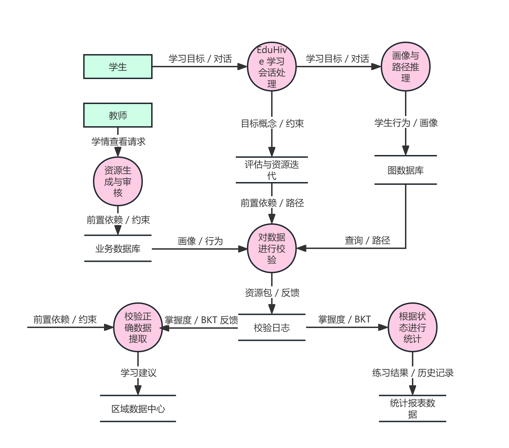

**图 16：学习闭环数据流图（DFD）**。标准数据流图风格，外部实体“学生/教师”向 EduMate 学习会话处理输入学习目标/对话与学情查看请求；数据流经画像与路径推理、评估与资源迭代、对数据进行校验、校验正确数据提取、根据状态进行统计等处理过程，与图数据库、业务数据库、区域数据中心、统计报表数据等数据存储交互；通过掌握度/BKT 反馈形成学习闭环，并向教师输出学习建议。

## 六、总结与展望

### 6.1 核心创新总结

智慧伴学通过“大模型 + 知识图谱 + 多智能体”的融合架构，解决了高等教育程序设计课程中个性化学习资源生成与智能辅导的核心难题，并在工程层面完成了从门户入口到学习评估的完整闭环。作品的核心创新可概括为五个相互支撑的支点：

1. **神经符号认知架构**：以课程知识图谱为硬约束、以 AST 与事实校验为后验，把大模型生成“框”在课程边界内，显著抑制幻觉、超纲与不可运行代码；
2. **多智能体协同编排与启发式辅导**：将教学过程拆分为 5 个专业化角色，配合 4-Prompt 辩论议会（多角色校验小组）、苏格拉底式启发辅导与熔断降级机制，使复杂教学过程可解释、可扩展、可监控，同时兼具教学温度；
3. **基于证据的动态画像**：将学习行为转化为画像证据，通过加权投票与阈值机制实现随学随新的精准学生建模，避免画像抖动；
4. **认知风格自适应渲染**：同一知识点按文字型、视觉型、听觉型、动觉型四种偏好差异化呈现，真正降低认知负荷、提升学习投入度；
5. **BKT 驱动的学习闭环**：用标准贝叶斯知识追踪量化每个知识点的掌握概率，并据此动态调整学习路径与资源推送，实现自我增强的个性化闭环。

### 6.2 技术可行性

系统已在前端构建、后端部署、端到端功能测试等环节完成验证：

- 前端生产构建通过，生产预览稳定，构建产物可直接部署；
- 后端健康检查正常，核心 API 返回符合预期；
- 12 个核心模块端到端测试通过，生成 22 张过程截图，覆盖从门户登录到掌握度评估的主要学习链路；
- Docker Compose 方案可在常规环境下快速复现；
- LLM_PROVIDER=mock 模式下无需外部 API Key 即可完成全部功能演示，降低部署环境对外部服务的依赖。

### 6.3 应用价值

- **对学生**：显著提升自主学习效率，降低知识筛选成本，获得因材施教的学习体验；
- **对教师**：减轻重复性备课、答疑与学情分析负担，提供数据驱动的教学决策支持；
- **对高校**：为程序设计课程提供可落地、可扩展、可演示的智能化教学工具，助力教育数字化转型。

### 6.4 后续优化与拓展方向

系统当前已完成核心功能并通过端到端验证，在此基础上，我们规划了以下持续优化方向，以进一步提升系统完整性与应用深度：

1. **目标概念状态进一步统一**：持续优化前端各模块对目标概念的引用方式，以会话中的目标概念为单一数据源，进一步提升界面一致性。
2. **会话持久化体验增强**：在已有 SQLite 后端持久化基础上，增加浏览器本地存储的会话 ID 恢复机制，使刷新页面后学习记录能够无缝衔接。
3. **认知风格策略深化**：当前认知风格已支持前端差异化渲染，后续将进一步让画像结果影响资源生成 Prompt、练习题排序与对话策略，实现更深度的个性化。
4. **练习题预期输出补齐**：持续完善资源生成阶段的质量校验，确保每道可判题练习均具备预期输出，进一步提升自动判题覆盖率。
5. **BKT 与 Evaluator 深度融合**：BKT 核心模型已采用标准贝叶斯公式，后续将进一步深化 Evaluator 与 BKT 的联动规则，并接入更多行为特征，提升评估科学性。
6. **知识熔炉结构化 diff**：当前版本演进已展示时间线，后续将增加版本间差异、触发原因、错误率来源等结构化信息，增强可解释性。
7. **多课程扩展**：当前以 Python 程序设计基础为核心，后续将向数据结构、人工智能导论等课程快速迁移。
8. **更多模态资源**：持续接入教学短视频、动画、交互式可视化等多模态资源生成能力。
9. **LMS 集成**：探索与超星、雨课堂等现有教学平台的数据与账号集成，推动系统规模化应用。

---

## 参考文献

1. 第十五届中国软件杯大赛组委会. 基于大模型的个性化资源生成与学习多智能体系统开发赛题说明. 2026.
2. 科大讯飞股份有限公司. 讯飞星火大模型开发文档. https://xinghuo.xfyun.cn/
3. DeepSeek. DeepSeek API 文档. https://platform.deepseek.com/
4. Neo4j Inc. Neo4j Graph Database Documentation. https://neo4j.com/docs/
5. Pyodide. Pyodide Documentation. https://pyodide.org/en/stable/
6. Corbett, A. T., & Anderson, J. R. (1994). Knowledge tracing: Modeling the acquisition of procedural knowledge. *User Modeling and User-Adapted Interaction*, 4(4), 253-278.
7. Marvin Minsky. *The Society of Mind*. Simon & Schuster, 1986.
8. FastAPI. FastAPI Documentation. https://fastapi.tiangolo.com/
9. React. React Documentation. https://react.dev/
10. Vite. Vite Documentation. https://vitejs.dev/

---

## 附录

### 附录 A：系统主要界面截图索引

端到端测试共生成 22 张过程截图，保存在 docs/test-screenshots/ 目录下，涵盖：

- 课程门户首页
- 课程工作台初始化
- 知识图谱路径加载与节点交互
- 学习资源页面与认知风格切换
- AI 学习对话
- 代码沙箱运行
- 掌握进度 / BKT 热力图
- 学习画像与 Agent 协作
- 刷新持久化测试与问题记录

### 附录 B：端到端测试报告

详见 docs/TEST_REPORT_20260715.md。

### 附录 C：开源组件与 AI 工具使用说明

| 组件/工具 | 协议/来源 | 用途 |
|-----------|----------|------|
| React | MIT | 前端框架 |
| Vite | MIT | 前端构建工具 |
| Tailwind CSS | MIT | CSS 框架 |
| shadcn/ui | MIT | UI 组件库 |
| Radix UI | MIT | 无头 UI 组件 |
| Monaco Editor | MIT | 代码编辑器 |
| Framer Motion | MIT | 动画库 |
| ECharts | Apache-2.0 | 图表库 |
| Pyodide | MPL 2.0 | 浏览器 Python 执行 |
| FastAPI | MIT | Web 框架 |
| Uvicorn | BSD | ASGI 服务器 |
| Pydantic | MIT | 数据验证 |
| Neo4j Community | GPL v3 | 知识图谱 |
| sqlite-utils | Apache-2.0 | SQLite 工具库 |
| python-jose | MIT | JWT 处理 |
| passlib | BSD | 密码哈希 |
| 讯飞星火 4.5 Max | 讯飞开放平台 | 主推理模型 |
| 讯飞星火 Spark Pro | 讯飞开放平台 | 辅助模型 |
| 讯飞语音合成 TTS | 讯飞开放平台 | 语音讲解 |
| 讯飞 iFlyCode | 讯飞开放平台 | 代码生成辅助 |

### 附录 D：部署与运行指南

详见项目根目录 README.md 与 DEPLOYMENT.md。

### 附录 E：核心 API 接口清单

| 接口 | 方法 | 说明 |
|------|------|------|
| /api/auth/login | POST | 用户登录，返回 JWT |
| /api/auth/register | POST | 用户注册 |
| /api/sessions | POST | 创建学习会话 |
| /api/sessions/{id} | GET | 获取会话状态 |
| /api/chat | POST | AI 学习对话 |
| /api/resources/generate | POST | 同步生成资源 |
| /api/resources/generate-for-session/{id} | POST | 为指定会话生成资源 |
| /api/resources/stream-generate | GET | SSE 流式生成资源 |
| /api/resources/{id}/feedback | POST | 资源反馈 |
| /api/resources/{id}/versions | GET | 资源版本演进 |
| /api/code/execute | POST | 执行 Python 代码 |
| /api/code/judge | POST | 代码判题 |
| /api/graph/layout | GET | 知识图谱布局 |
| /api/graph/path | GET | 学习路径 |
| /api/learning-plan/{id} | GET | 个人学习规划 |
| /api/evaluation/heatmap | GET | 掌握度热力图 |
| /api/evaluation/bkt | GET | BKT 详细状态 |
| /api/evaluation/analyze | POST | 触发掌握度分析 |
| /api/behavior/log | POST | 上报学习行为 |
| /health | GET | 健康检查 |

### 附录 F：文档配图清单

| 图号 | 文件位置（相对 `docs/`） | 类型 | 内容说明 | 对应章节 | 来源/制作方式 |
|------|------------------------|------|---------|---------|--------------|
| 图 1 | `images/fig1-application-scenarios.png` | 用例图 | 智慧伴学应用场景示意图（课后自主学习、翻转课堂、考前巩固、教师学情分析） | 1.1 | `scripts/generate_engineering_figures.py` |
| 图 2 | `new_image/f2总体数据.png` | 闭环示意图 | 系统总体数据闭环（S 型流水线/分层布局） | 2.1 | `docs/new_image/` AI 生成示意图 |
| 图 3 | `new_image/f3系统总体五层架构.png` | 架构图 | 系统总体五层架构（L1–L5 分层 + 模块职责） | 2.2 | `docs/new_image/` AI 生成示意图 |
| 图 4 | `new_image/f4多智能体协同架构图.png` | 架构图 | 多智能体协同架构（用户/编排/执行/依赖四层 + 多角色校验小组） | 2.3 | `docs/new_image/` AI 生成示意图 |
| 图 5 | `images/fig5-profile-evidence.png` | 界面截图 | 学习画像与证据追踪 | 2.4 | `docs/test-screenshots/` 真实 UI 截图 |
| 图 6 | `new_image/f6神经符号约束流程.png` | 流程图 | 神经符号约束流程（约束提取/LLM 生成/生成后校验/输出反馈） | 2.5 | `docs/new_image/` AI 生成示意图 |
| 图 7 | `new_image/f7资源生成审核流程.png` | 流程图 | 资源生成与审核流程（含判断菱形与反馈回路） | 2.6 | `docs/new_image/` AI 生成示意图 |
| 图 8 | `images/fig8-learning-path.png` | 界面截图 | 知识图谱与学习路径规划 | 2.7 | `docs/test-screenshots/` 真实 UI 截图 |
| 图 9 | `images/fig9-socratic-stages.png` | 界面截图 | 苏格拉底辅导五阶段流程 | 2.8 | `docs/test-screenshots/` 真实 UI 截图 |
| 图 10 | `images/fig10-bkt-heatmap.png` | 界面截图 | BKT 掌握度热力图 | 2.9 | `docs/test-screenshots/` 真实 UI 截图 |
| 图 11 | `new_image/evidence/5_4_cognitive_styles.png` | 界面截图拼接 | 认知风格自适应渲染对比（真实 UI 2×2 四宫格） | 2.11 / 5.4 | `docs/test-screenshots/` 真实 UI 截图拼接 |
| 图 12 | `images/fig12-course-workspace.png` | 界面截图 | 课程工作台主界面 | 3.2 | `docs/test-screenshots/` 真实 UI 截图 |
| 图 13 | `images/fig13-code-sandbox.png` | 界面截图 | 代码沙箱运行与自动判题 | 3.4 | `docs/test-screenshots/` 真实 UI 截图 |
| 图 14 | `images/fig14-performance.png` | 统计图 | 性能优化前后对比（三个子图） | 4.2 | `scripts/generate_engineering_figures.py` |
| 图 15 | `images/fig15-digital-human.png` | 界面示意图 | 数字人助教界面效果（状态机 + 控制面板：语速/知识点/语音输入/引导问题） | 2.12 | `scripts/generate_engineering_figures.py` |
| 图 16 | `new_image/f16.png` | 数据流图 | 学习闭环数据流图（DFD，含外部实体/过程/数据存储） | 5.6 | `docs/new_image/` AI 生成示意图 |

#### 配图状态说明

- **最终保留并嵌入正文**：图 2–4、图 6–7、图 16 现引用 `docs/new_image/` 中由 AI 生成的蓝白科技风示意图；图 1、图 11、图 14 仍由 `scripts/generate_engineering_figures.py` 统一生成；图 5、图 8–10、图 12–13 为 `docs/test-screenshots/` 真实 UI 截图。正文中均已使用 Markdown 图片语法实际引用，可直接渲染。
- **输出格式**：`docs/new_image/` 存放本轮由 AI 生成的高清 PNG 示意图；`docs/images/` 仍保留 `scripts/generate_engineering_figures.py` 生成的可编辑 SVG 与 300 DPI PNG 作为备份；`docs/figures/` 与 `docs/images/deprecated/` 等旧目录已清理，不再保留。
- **工程化风格**：本轮替换的系统架构图、数据流图、流程图采用 AI 生成的蓝白科技风示意图；图 1/11/14 仍为脚本生成的工程化矢量图，保持统一配色与标准图元。
- **已归档/删除的旧资源**：
  - `scripts/generate_academic_figures.py` 已归档至 `scripts/deprecated/generate_academic_figures.py`；
  - `docs/figures/`（图 3/4/6 旧高清副本）已删除；
  - `docs/images/deprecated/`（旧版占位图）已删除。
- **备用素材**：`docs/test-screenshots/` 目录保留端到端测试截图，可用于答辩演示或补充真实界面细节。

---

*文档版本：v2.3*  
*最后更新：2026-07-15*